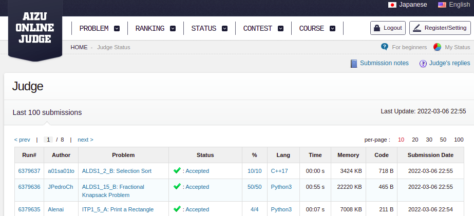

Tema:
 - Greed

# Dupla21

**Número da Lista**: 21<br>
**Conteúdo da Disciplina**: Greed<br>

## Alunos
|Matrícula | Aluno |
| -- | -- |
| 18/0123203 |  João Pedro Alves da Silva Chaves |
| 19/0026243  |  Dafne Moretti Moreira |


## Sobre 

Este repositório contém quatro questões de juízes online sobre algoritmos ambiciosos.

Os links para acessar a descrição das questões são:

* [Fractional Knapsack](https://judge.u-aizu.ac.jp/onlinejudge/description.jsp?id=ALDS1_15_B)

* [Cédulas](https://www.beecrowd.com.br/judge/pt/problems/view/1018)

* [I am very busy](https://www.spoj.com/problems/BUSYMAN/)

* [Milk Scheduling](https://www.spoj.com/problems/MSCHED/)

## Screenshots

Abaixo constam os screenshots demonstrando que os problemas foram aceitos nos juízes online.

### Fractional Knapsack


### Cedulas


### Milk Scheduling


### Busy


## Instalação 
**Linguagem**: Python<br>
**Framework**: Não há<br>

## Uso 

Para rodar as questões, acesse o terminal do seu computador e digite 

```python 3 <nome_da_questao.py>```

## Apresentação 

Link para a apresentação:

